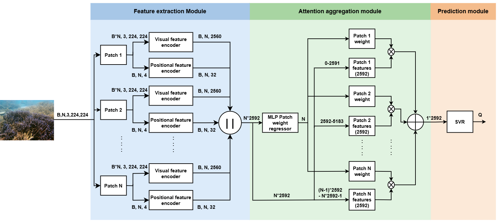

## Block Diagram



## Steps to import and run the project

1. Clone the project

```bash
git clone https://github.com/RohanRaviKumar/VPUWIQE.git
```

2. Install dependences

```bash
pip install -r requirements.txt
```

3. Run the web app

```bash
#For UID code
python uid_app.py

#For SAUD code
python saud_app.py
```

Open this link `http://127.0.0.1:5000/` on your browser and upload a `.png`, `.jpg`, or `.jpeg` image to get a predicted quality score.